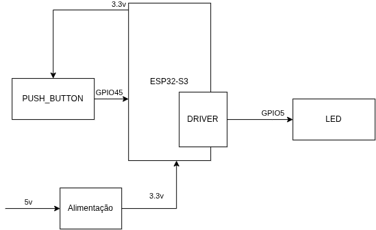
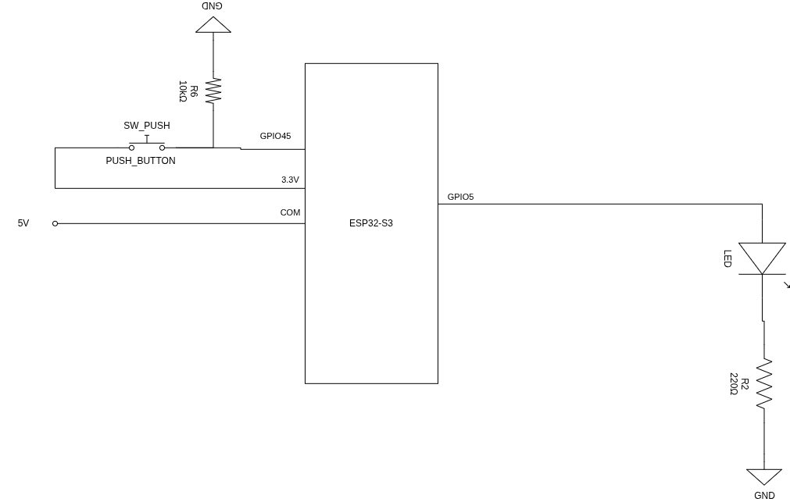

# ATV 06 (GPIO)

Implementar o controle de um LED via botão utilizando a técnica de polling e controle de
tempo via software, garantindo que o sistema permaneça responsivo.

- Condição 1 (LED Apagado): Ao pressionar o botão, o LED acende e a contagem de 30 segundos é iniciada.
- Condição 2 (LED Aceso - Pressionar Duplo/Longo): Se o botão for pressionado novamente enquanto o LED estiver aceso, o temporizador deve ser reiniciado (resetado para os 30) sem apagar o LED.
- Condição 3 (Desligamento Manual): Um pressionamento longo (ex: botão mantido por mais de 2 segundo) força o desligamento imediato.

Observações:
* O sistema deve realizar a leitura do botão por polling em um laço não bloqueante.
* Implementar rotina de tratamento debounce.
* Fica **estritamente proibido** o uso de vTaskDelay(), rom_delay_us() ou qualquerfunção de atraso.

---

## Componentes
● 1 ESP32 (DevKit)
● 1 LED + 1 Resistor de 220 Ω
● 1 Botão + 1 Resistor de 10 kΩ
● Protoboard e cabos

## Diagrama em Bloco

## Diagrama Esquemático Elétrico

## Código desenvolvido
Disponível em [`main.c`](./main.c)

https://wokwi.com/projects/476055430559042561